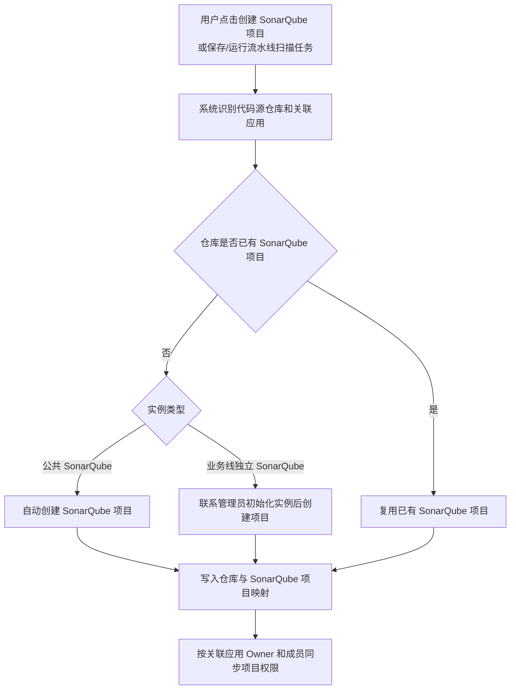

# Flux SonarQube 代码扫描能力 PRD（评审版）

## 1. 背景与目标

### 背景

当前业务希望在 Flux DevOps 中接入 SonarQube 代码扫描能力，统一代码质量检查、质量门禁和扫描结果通知。

本期采用“Flux 做入口，SonarQube 做工作台”的方式：

- Flux 负责扫描配置、扫描触发、流水线阻断、通知配置和权限同步。
- SonarQube 负责规则配置、质量门禁配置、问题分析和扫描详情查看。

### 目标

- 在 Flux DevOps 中提供独立的代码扫描入口。
- 支持代码仓库接入 SonarQube，并建立仓库与 SonarQube 项目的唯一映射。
- 流水线已有 SonarQube 代码扫描任务不选择代码扫描配置。
- 支持公共 SonarQube 默认接入，业务线独立 SonarQube 需管理员初始化后接入。
- 支持质量门禁失败时按配置决定是否阻断流水线。
- 支持按质量门禁结果和扫描执行状态发送扫描摘要、质量门禁结果和 SonarQube 详情链接。
- 支持 Flux 应用成员权限同步到 SonarQube。

## 2. 关键业务规则

### 仓库与 SonarQube 项目

- 一个代码仓库对应一个 SonarQube 项目。
- 同一仓库被多个应用或流水线使用时，不重复创建 SonarQube 项目。
- 同一仓库被多个应用使用时，SonarQube 项目权限按关联应用成员做并集。

### 仓库绑定

- 创建 SonarQube 项目时选择代码仓库。
- 创建后不支持直接修改绑定仓库。
- 如需更换仓库，需重新创建 SonarQube 项目。
- 配置流水线 SonarQube 代码扫描任务时，不需要选择代码扫描配置。
- 保存流水线任务时，系统按代码源仓库自动创建或复用 SonarQube 项目；不自动创建 Flux 代码扫描配置。
- 原因：修改仓库会影响 SonarQube 项目、扫描历史、权限同步、流水线引用关系，属于高风险迁移场景，本期不支持。

### SonarQube 实例类型

- 公共 SonarQube：平台默认逻辑，系统自动创建或复用项目。
- 业务线独立 SonarQube：需先联系管理员完成实例初始化配置，再创建或复用项目。

### 扫描范围

- 代码扫描页面触发的扫描为全量扫描，按所选分支和扫描路径完整扫描。
- 流水线执行的 SonarQube 代码扫描任务为增量扫描，以运行流水线时选择的主分支为基线，只扫描相对主分支新增或修改的代码。
- 扫描记录需保留触发方式，用于区分手动全量扫描和流水线增量扫描。

### 存量数据处理

- 社交中心数据无需初始化，直接运行流水线即可按代码源仓库创建或复用 SonarQube 项目。
- 其他已使用代码扫描配置的用户，需上线后联系用户绑定关联应用。
- 存量配置的扫描路径、触发规则、通知模板保持不变；质量规则/门禁配置以 SonarQube 项目配置为准。关联应用 Owner 作为配置拥有人。
- 关联应用为必填；存量配置需补齐关联应用后再完成权限同步和 SonarQube 授权。
- 绑定 SonarQube 已有项目时，Flux 按关联应用 Owner 和关联应用成员重新计算并覆盖同步 SonarQube 项目权限。

### 存量流水线任务

- 存量流水线中的 SonarQube 代码扫描任务无需业务方重新配置。
- 上线后按代码源仓库自动创建或复用 SonarQube 项目；不自动创建 Flux 代码扫描配置。

### 流水线阻断

- SonarQube 分析完成后返回质量门禁结果。
- `质量门禁失败时阻断` 开启时，质量门禁失败则流水线失败/阻断。
- 关闭时，仅记录扫描结果并发送通知，不阻断流水线。

## 3. 核心流程

### 首次接入

1. 用户进入 `Flux DevOps > 代码管理 > 代码扫描`。
2. 点击 `创建 SonarQube 项目`。
3. 选择代码仓库、关联应用并确认。
4. 系统根据代码仓库创建或复用 SonarQube 项目。
5. 系统同步关联应用 Owner 和成员权限。
6. 创建完成后停留在列表页，不再跳转配置页二次保存。

### 新 SonarQube 项目创建与权限同步

### 日常扫描

1. 用户提交代码或手动启动扫描。
2. Flux 触发 SonarQube Scanner 执行扫描。
3. SonarQube 完成分析并返回质量门禁结果。
4. Flux 记录扫描结果。
5. 如在流水线中执行，则按阻断开关决定是否阻断流水线。
6. 扫描完成后发送代码扫描通知。
7. 用户点击 `查看详情` 跳转 SonarQube 查看扫描详情。

## 4. 页面与交互

### 4.1 代码扫描列表

入口：`Flux DevOps > 代码管理 > 代码扫描`

列表字段：

| 字段 | 说明 |
| --- | --- |
| 仓库名称 | 代码仓库名称 |
| 路径 | 代码仓库 Git 地址 |
| 关联应用 | 当前扫描配置关联的 Flux 应用，展示不换行 |
| 拥有人 | 扫描配置关联应用的 Owner；关联多个应用时展示多个 Owner |
| 创建时间 | 扫描配置创建时间，支持排序 |
| 触发规则 | 手动触发、推送到分支等 |
| 操作 | SonarQube、启动扫描、扫描记录、配置 |

说明：

- `SonarQube`：跳转 SonarQube 对应项目。
- `启动扫描`：选择分支后手动触发扫描。
- `扫描记录`：进入当前仓库扫描记录页。
- `配置`：进入扫描配置详情页。可编辑用户进入编辑态，只读用户进入只读态。

### 4.2 创建 SonarQube 项目

弹窗字段：

| 字段 | 必填 | 说明 |
| --- | --- | --- |
| 选择仓库 | 是 | 选择需要接入代码扫描的代码仓库 |
| 选择应用 | 是 | 选择扫描配置关联的 Flux 应用，可多选；范围为当前用户作为 Owner 的应用 |

规则：

- 所有人都可以创建 SonarQube 项目。
- 创建 SonarQube 项目时必须选择关联应用，用于确定配置可见范围和 SonarQube 权限同步范围。
- 一个代码仓库只对应一个 SonarQube 项目。
- 仓库尚未创建 SonarQube 项目时，系统自动创建。
- 仓库已存在 SonarQube 项目时，复用原项目。
- 点击确定后直接创建或复用 SonarQube 项目，不再跳转配置页二次保存。
- 创建后，所选关联应用 Owner 成为该扫描配置拥有人。

### 4.3 扫描配置页

配置模块：

- 基本信息：关联应用、主要语言、包含路径、排除路径、备注。
- 自动触发规则：推送到指定分支时触发；新建合并请求到指定分支时扫描源分支。
- 扫描结果：选择通知模板，最多 3 个。

只读态：

- 关联应用普通成员可进入配置页查看。
- 只读态不展示保存按钮，输入框、下拉框、单选、复选不可操作。

### 4.4 扫描记录页

字段：

| 字段 | 说明 |
| --- | --- |
| 扫描分支 | 本次扫描分支 |
| 扫描结果 | 阻断违规、严重违规、主要违规、次要违规、提示违规、覆盖率 |
| 触发方式 | 推送到分支、手动触发等，支持筛选 |
| 操作人 | 触发扫描的用户 |
| 最新扫描时间 | 最新扫描完成时间 |
| 操作 | 查看详情 |

规则：

- `查看详情` 跳转 SonarQube 对应扫描记录地址。
- Flux 不承载 SonarQube 问题详情分析。

### 4.5 启动扫描弹窗

字段：

| 字段 | 必填 | 说明 |
| --- | --- | --- |
| 选择分支 | 是 | 选择需要手动扫描的分支 |

规则：

- 从代码扫描页面点击 `启动扫描` 触发的是全量扫描。
- 全量扫描按所选分支和扫描路径完整执行代码扫描。
- 弹窗中提示用户启动扫描前先完善配置，确认主要语言、扫描路径等配置。
- 点击确定后触发扫描任务。

### 4.6 流水线 SonarQube 代码扫描任务

调整流水线已有 `SonarQube 代码扫描` 任务。

规则：

- 不需要在任务中选择代码仓库，流水线开头已有代码源。
- 流水线任务不选择代码扫描配置。
- 保存流水线任务时，系统按代码源仓库自动创建或复用 SonarQube 项目。
- 流水线执行 SonarQube 代码扫描任务时为增量扫描。
- 增量扫描以运行流水线时选择的主分支为基线，只扫描相对主分支新增或修改的代码。
- 任务参数仅影响本条流水线扫描行为，不覆盖 SonarQube 规则/门禁配置。
- 任务抽屉保持现有样式，移除原 `通知人` 字段。
- 通知统一在流水线 `报警通知` 页面配置。

关键字段：

| 字段 | 说明 |
| --- | --- |
| 任务名称 | 默认 SonarQube 代码扫描 |
| 语言类型 | Java、Scala 等 |
| 模块名称 | 代码模块名称 |
| 指定子模块 | 是否指定子模块 |
| 源代码路径 | 如 src |
| 二进制文件路径 | 如 target/classes |
| 质量门禁失败时阻断 | 开关。关闭后仅记录扫描结果并发送通知，不阻断流水线 |

## 5. 权限规则

### 5.1 权限主体定义

| 权限主体 | 成为条件 / 来源 |
| --- | --- |
| 关联应用 Owner | 扫描配置关联的 Flux 应用当前 Owner；应用 Owner 转移后，新 Owner 成为该权限主体 |
| 关联应用普通成员 | 扫描配置关联的 Flux 应用成员，且不是关联应用 Owner |
| 无关联权限用户 | 不属于关联应用 Owner、关联应用普通成员，也不是平台管理员 |
| 平台管理员 | 具备 Flux DevOps / 平台管理权限的管理员 |

### 5.2 Flux 配置权限

| 权限主体 | 列表可见 | 扫描记录可见 | 配置详情可见 | 修改配置 |
| --- | --- | --- | --- | --- |
| 关联应用 Owner | 是 | 是 | 是 | 是 |
| 关联应用普通成员 | 是 | 是 | 是 | 否 |
| 无关联权限用户 | 否 | 否 | 否 | 否 |
| 平台管理员 | 是 | 是 | 是 | 是 |

规则：

- 扫描配置拥有人等同于关联应用 Owner。
- 关联多个应用时，任一关联应用 Owner 均可修改该扫描配置。
- 关联应用普通成员仅可查看。
- 创建人作为审计信息保留，不作为当前权限字段。
- 同一用户命中多个权限主体时，按最高权限生效。
- 应用 Owner 转移后，新 Owner 接管该应用关联扫描配置的修改权限。

### 5.3 SonarQube 项目权限

| 权限主体 | SonarQube 项目可见 | 规则/门禁编辑 |
| --- | --- | --- |
| 关联应用 Owner | 是 | 是 |
| 关联应用普通成员 | 是 | 否 |
| 无关联权限用户 | 否 | 否 |

规则：

- 上线时，Flux 按关联应用 Owner、关联应用成员初始化并覆盖同步 SonarQube 项目权限。
- 上线后，关联应用 Owner、关联应用成员发生变化时，Flux 按最新关联关系覆盖同步 SonarQube 项目权限。
- 应用 Owner 转移后，新 Owner 获得 Flux 配置修改权限和 SonarQube 规则/门禁编辑权限。
- 原 Owner 不再是关联应用 Owner 后，移除其编辑权限；如仍是关联应用普通成员，仅保留查看权限。
- 同一用户命中多个权限主体时，按最高权限同步 SonarQube 权限。

## 6. 通知配置

报警通知页拆分为：

- 流水线运行通知
- 代码扫描通知
- OnCall 通知

代码扫描通知：

| 字段 | 说明 |
| --- | --- |
| 开关 | 是否启用代码扫描通知 |
| 报警事件 | 默认不勾选；可选：质量门禁通过、质量门禁未通过、扫描执行失败 / 异常 |
| 通知模板 | 选择通知模板，最多 3 个 |

通知内容：

- 扫描摘要
- 质量门禁结果
- SonarQube 详情链接

规则：

- 报警事件支持勾选一个或多个。
- 质量门禁通过、质量门禁未通过适用于扫描执行成功并返回质量门禁结果的场景。
- 扫描执行失败 / 异常适用于代码拉取失败、SonarQube 分析失败、任务超时等未正常完成的场景。
- 邮件正文中，SonarQube 详情链接展示在扫描结果下方。
- 邮件正文底部值班信息中，开发联系人展示为：吴文君 010-56601270。
- 邮件正文底部不再展示 Panther QQ 群；如需咨询，引导用户通过 Panther 平台按问题类型联系对应支持人员，并提供“帮助文档”链接查看使用方式：`https://panther.sohurdc.com/control/system-notification/detailmsg/485`。
- 是否发送通知由“代码扫描通知”开关、报警事件和通知模板共同决定。
- 报警事件默认不勾选，需用户按需选择。

## 7. 原型与待确认

原型：

- `sonarqube-code-scan/index.html`

详细版 PRD：

- `PRD-SonarQube-Code-Scan.md`

待研发确认：

- SonarQube Java / Python / Go 等语言插件是否已具备扫描能力，是否需要预装社区插件。
- SonarQube 权限同步接口能力：项目创建、用户创建、用户组/项目权限绑定、规则/门禁编辑权限授权。
- Owner 转移事件是否有稳定事件源，可用于触发权限重算。
- 权限同步失败后的重试策略、日志字段和后台排查入口。
- 存量代码扫描配置和存量流水线扫描任务的数据量、异常数据及迁移脚本。
