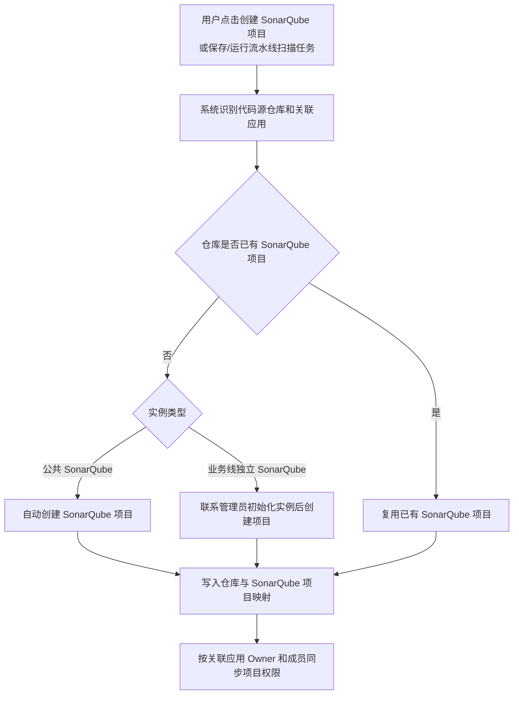

# Flux SonarQube 代码扫描能力 PRD

## 1. 需求背景

社交中心业务线希望加强统一的代码质量管理，当前存在以下问题：

- 代码质量缺少自动化检测手段，问题发现滞后。
- 缺少统一的代码扫描规则、质量门禁和质量标准。
- 开发者无法在统一入口自助查看项目代码质量问题。
- SonarQube 原生平台具备规则配置、质量门禁、问题分析能力，但需要 Flux 平台完成接入、触发、通知和权限自动化。

本期采用“Flux 做入口，SonarQube 做工作台”的方案：Flux 负责代码扫描配置、权限同步、扫描触发、流水线阻断和通知；SonarQube 负责规则配置、质量门禁配置、扫描结果分析和问题详情查看。

## 2. 目标与价值

### 产品目标

- 在 Flux DevOps 中提供独立的代码扫描入口。
- 支持将代码仓库接入 SonarQube，并建立仓库与 SonarQube 项目的唯一映射。
- 支持通过流水线任务触发 SonarQube 扫描，并根据质量门禁结果决定是否阻断流水线。
- 支持按质量门禁结果和扫描执行状态发送独立的代码扫描通知。
- 支持 Flux 应用成员权限自动同步到 SonarQube，减少人工授权成本。

### 用户价值

- 项目 Owner 可以快速接入代码扫描能力。
- 开发者可以查看自己有权限仓库的扫描记录和 SonarQube 详情。
- 流水线执行时可以自动完成代码质量检查，并在必要时阻断低质量代码进入后续流程。

### 不解决的问题

- 不在 Flux 中重复建设 SonarQube 的规则配置、质量门禁配置、问题分析能力。
- 不在本期支持修改已绑定的代码仓库。
- 不在本期处理 SonarQube 历史扫描数据迁移。

## 3. 使用角色与场景

| 角色 | 说明 | 典型场景 |
| --- | --- | --- |
| 关联应用 Owner | 扫描配置关联的 Flux 应用 Owner，也是该扫描配置的拥有人 | 查看和修改配置；如果应用转移给新 Owner，新 Owner 接管配置修改 |
| 关联应用成员 | 关联应用下的普通成员 | 查看代码扫描列表、扫描记录、配置详情、SonarQube 项目 |
| 流水线配置人 | 配置流水线任务的用户 | 配置流水线中的 SonarQube 代码扫描任务 |
| 平台管理员 | 平台运维/管理员 | 处理异常权限、Owner 转移、实例配置等管理事项 |

## 4. 功能范围

### 本期包含

- Flux 代码扫描独立菜单页。
- 创建 SonarQube 项目。
- 代码扫描列表。
- 扫描记录页。
- 扫描配置详情/编辑页。
- 手动启动扫描。
- 流水线 SonarQube 代码扫描任务。
- 代码扫描通知配置。
- Flux 应用成员与 SonarQube 项目权限同步。
- Panther SAML 免登录跳转 SonarQube。

### 本期不包含

- Flux 内置 SonarQube 规则配置页面。
- Flux 内置 SonarQube 问题详情分析页面。
- 修改已绑定代码仓库。
- SonarQube 项目历史数据迁移。
- 多语言插件能力完整性验证，需研发调研 Java / Python / Go 等语言插件支持情况。

## 5. 页面结构与交互

### 5.1 入口位置

入口位于：

`Flux DevOps > 代码管理 > 代码扫描`

代码扫描为独立菜单页。

### 5.2 代码扫描列表

列表字段：

| 字段 | 说明 |
| --- | --- |
| 仓库名称 | 代码仓库名称 |
| 路径 | 代码仓库 Git 地址 |
| 关联应用 | 当前扫描配置关联的 Flux 应用，展示时不换行 |
| 拥有人 | 扫描配置关联应用的 Owner；关联多个应用时展示多个 Owner |
| 创建时间 | 扫描配置创建时间，支持排序 |
| 触发规则 | 展示手动触发、推送到分支等触发规则 |
| 操作 | SonarQube、启动扫描、扫描记录、配置 |

操作说明：

- `SonarQube`：跳转 SonarQube 对应项目。
- `创建 SonarQube 项目`：打开创建 SonarQube 项目弹窗。
- `启动扫描`：打开启动扫描弹窗，选择分支后触发扫描。
- `扫描记录`：进入扫描记录页面。
- `配置`：进入配置详情页。

权限说明：

- 所有可见用户均可点击 `配置`。
- 关联应用 Owner 可修改配置；存在多个关联应用 Owner 时，任一 Owner 均可修改配置。
- 关联应用普通成员仅可查看配置，配置页只读，不展示保存按钮。
- 创建人作为审计信息保留，不作为列表主权限字段展示。

### 5.3 创建 SonarQube 项目弹窗

字段：

| 字段 | 必填 | 说明 |
| --- | --- | --- |
| 选择仓库 | 是 | 选择需要接入代码扫描的代码仓库 |
| 选择应用 | 是 | 选择扫描配置关联的 Flux 应用，可多选；范围为当前用户作为 Owner 的应用 |

规则：

- 所有人都可以创建 SonarQube 项目。
- 创建 SonarQube 项目时必须选择关联应用，用于确定配置可见范围和 SonarQube 权限同步范围。
- 一个代码仓库只对应一个 SonarQube 项目。
- 如果所选仓库尚未创建 SonarQube 项目，系统自动创建 SonarQube 项目。
- 如果所选仓库已存在 SonarQube 项目，复用原 SonarQube 项目，不重复创建。
- 点击确定后直接创建或复用 SonarQube 项目，不再跳转配置页二次保存。
- 创建后，所选关联应用 Owner 成为该扫描配置拥有人。

### 5.4 扫描配置页

模块：

- 基本信息
- 自动触发规则
- 扫描结果

基本信息字段：

| 字段 | 说明 |
| --- | --- |
| 关联应用 | 下拉选择关联应用，可多选 |
| 主要语言 | Java、Scala、Python、C++、JavaScript、Go |
| 包含路径 | 扫描包含路径 |
| 排除路径 | 扫描排除路径 |
| 备注 | 补充说明 |

自动触发规则：

- 推送到指定分支时触发。
- 新建合并请求到指定分支时扫描源分支。

扫描结果：

- 支持选择通知模板，最多选择 3 个。
- 模板用于扫描完成后的通知发送。

只读态：

- 关联应用普通成员进入配置页时，只能查看配置。
- 输入框、下拉框、单选、复选、保存按钮不可操作或不展示。

### 5.5 启动扫描弹窗

字段：

| 字段 | 必填 | 说明 |
| --- | --- | --- |
| 选择分支 | 是 | 选择需要手动扫描的分支 |

规则：

- 从代码扫描页面点击 `启动扫描` 触发的是全量扫描。
- 全量扫描按所选分支和扫描路径完整执行代码扫描。
- 弹窗中提示用户启动扫描前先完善配置，确认主要语言、扫描路径等配置。
- 点击确定后触发扫描任务。

### 5.6 扫描记录页

字段：

| 字段 | 说明 |
| --- | --- |
| 扫描分支 | 本次扫描分支 |
| 扫描结果 | 阻断违规、严重违规、主要违规、次要违规、提示违规、覆盖率 |
| 触发方式 | 推送到分支、手动触发等，支持筛选 |
| 操作人 | 触发扫描的用户 |
| 最新扫描时间 | 最新扫描完成时间 |
| 操作 | 查看详情 |

规则：

- `查看详情` 跳转对应 SonarQube 扫描记录地址。
- Flux 不展示 SonarQube 问题详情，只提供跳转入口。

### 5.7 流水线 SonarQube 代码扫描任务

调整流水线已有 `SonarQube 代码扫描` 任务。

规则：

- 不需要在任务中选择代码仓库，流水线开头已有代码源。
- 流水线任务不选择代码扫描配置。
- 保存流水线任务时，系统按代码源仓库自动创建或复用 SonarQube 项目。
- 流水线执行 SonarQube 代码扫描任务时为增量扫描。
- 增量扫描以运行流水线时选择的主分支为基线，只扫描相对主分支新增或修改的代码。
- 任务参数仅影响本条流水线扫描行为，不覆盖 SonarQube 规则/门禁配置。

字段：

| 字段 | 说明 |
| --- | --- |
| 任务名称 | 默认 SonarQube 代码扫描 |
| 语言类型 | Java、Scala 等 |
| 模块名称 | 代码模块名称 |
| 指定子模块 | 是否指定子模块 |
| 源代码路径 | 如 src |
| 二进制文件路径 | 如 target/classes |
| 质量门禁失败时阻断 | 开关。关闭后仅记录扫描结果并发送通知，不阻断流水线 |

说明：

- 原有 `通知人` 字段从该任务抽屉中移除。
- 通知统一在流水线 `报警通知` 页面配置。

### 5.8 流水线报警通知

报警通知页拆分为：

- 流水线运行通知
- 代码扫描通知
- OnCall 通知

代码扫描通知：

| 字段 | 说明 |
| --- | --- |
| 开关 | 是否启用代码扫描通知 |
| 报警事件 | 默认不勾选；可选：质量门禁通过、质量门禁未通过、扫描执行失败 / 异常 |
| 通知模板 | 选择通知模板，最多 3 个 |

文案：

扫描完成或执行失败后发送扫描摘要、质量门禁结果和 SonarQube 详情链接。

规则：

- 报警事件支持勾选一个或多个。
- 质量门禁通过、质量门禁未通过适用于扫描执行成功并返回质量门禁结果的场景。
- 扫描执行失败 / 异常适用于代码拉取失败、SonarQube 分析失败、任务超时等未正常完成的场景。
- 邮件正文中，SonarQube 详情链接展示在扫描结果下方。
- 邮件正文底部值班信息中，开发联系人展示为：吴文君 010-56601270。
- 邮件正文底部不再展示 Panther QQ 群；如需咨询，引导用户通过 Panther 平台按问题类型联系对应支持人员，并提供“帮助文档”链接查看使用方式：`https://panther.sohurdc.com/control/system-notification/detailmsg/485`。
- 是否发送通知由“代码扫描通知”开关、报警事件和通知模板共同决定。
- 报警事件默认不勾选，需用户按需选择。

## 6. 规则说明

### 6.1 仓库与 SonarQube 项目关系

- 一个代码仓库对应一个 SonarQube 项目。
- 同一代码仓库被多个 Flux 应用或流水线使用时，不重复创建 SonarQube 项目。
- 同一代码仓库被多个应用使用时，SonarQube 项目权限按关联应用成员做并集。

### 6.2 SonarQube 实例类型

| 实例类型 | 处理方式 |
| --- | --- |
| 公共 SonarQube | 平台默认逻辑，系统自动创建或复用项目 |
| 业务线独立 SonarQube | 需先联系管理员完成实例初始化配置，再创建或复用项目 |

### 6.2.1 扫描范围规则

- 代码扫描页面触发的扫描为全量扫描，按所选分支和扫描路径完整扫描。
- 流水线执行的 SonarQube 代码扫描任务为增量扫描，以运行流水线时选择的主分支为基线，只扫描相对主分支新增或修改的代码。
- 扫描记录需保留触发方式，用于区分手动全量扫描和流水线增量扫描。

### 6.3 仓库绑定规则

- 创建 SonarQube 项目时选择代码仓库。
- 创建后不支持直接修改绑定仓库。
- 如需更换仓库，需重新创建 SonarQube 项目。
- 配置流水线 SonarQube 代码扫描任务时，不需要选择代码扫描配置。
- 保存流水线任务时，系统按代码源仓库自动创建或复用 SonarQube 项目；不自动创建 Flux 代码扫描配置。
- 原因：修改仓库会影响 SonarQube 项目、扫描历史、权限同步、流水线引用关系，属于高风险迁移场景，不纳入本期范围。

### 6.4 存量代码扫描配置

- 社交中心数据无需初始化，直接运行流水线即可按代码源仓库创建或复用 SonarQube 项目。
- 其他已使用代码扫描配置的用户，需上线后联系用户绑定关联应用。
- 存量配置的扫描路径、触发规则、通知模板保持不变；质量规则/门禁配置以 SonarQube 项目配置为准。关联应用 Owner 作为配置拥有人。
- 关联应用为必填；存量配置需补齐关联应用后再完成权限同步和 SonarQube 授权。
- 绑定 SonarQube 已有项目时，Flux 按关联应用 Owner 和关联应用成员重新计算并覆盖同步 SonarQube 项目权限。
- Flux 扫描记录只记录新链路扫描结果，历史扫描不回填。
- 同仓库多配置需研发先核查，并按“一仓库一 SonarQube 项目”处理。

### 6.5 存量流水线任务

- 存量流水线中的 SonarQube 代码扫描任务无需业务方重新配置。
- 上线后按代码源仓库自动创建或复用 SonarQube 项目；不自动创建 Flux 代码扫描配置。
- 存量任务中的语言、模块、扫描路径和质量门禁阻断配置保持不变。

### 6.6 新 SonarQube 项目创建与权限同步流程

### 6.7 Flux 配置权限

权限主体定义：

| 权限主体 | 成为条件 / 来源 |
| --- | --- |
| 关联应用 Owner | 扫描配置关联的 Flux 应用当前 Owner；应用 Owner 转移后，新 Owner 成为该权限主体 |
| 关联应用普通成员 | 扫描配置关联的 Flux 应用成员，且不是关联应用 Owner |
| 无关联权限用户 | 不属于关联应用 Owner、关联应用普通成员，也不是平台管理员 |
| 平台管理员 | 具备 Flux DevOps / 平台管理权限的管理员 |

权限矩阵：

| 权限主体 | 列表可见 | 扫描记录可见 | 配置详情可见 | 修改配置 |
| --- | --- | --- | --- | --- |
| 关联应用 Owner | 是 | 是 | 是 | 是 |
| 关联应用普通成员 | 是 | 是 | 是 | 否 |
| 无关联权限用户 | 否 | 否 | 否 | 否 |
| 平台管理员 | 是 | 是 | 是 | 是 |

规则：

- 所有人都可以创建 SonarQube 项目。
- 扫描配置拥有人等同于关联应用 Owner。
- 关联多个应用时，任一关联应用 Owner 均可修改该扫描配置。
- 关联应用普通成员只读。
- 同一用户命中多个权限主体时，按最高权限生效。
- 应用 Owner 转移后，新 Owner 自动接管该应用关联扫描配置的修改权限。

### 6.8 SonarQube 项目权限

| 权限主体 | SonarQube 项目可见 | 规则/门禁编辑 |
| --- | --- | --- |
| 关联应用 Owner | 是 | 是 |
| 关联应用普通成员 | 是 | 否 |
| 无关联权限用户 | 否 | 否 |

规则：

- 上线时，Flux 按关联应用 Owner、关联应用成员初始化并覆盖同步 SonarQube 项目权限。
- 上线后，关联应用 Owner、关联应用成员发生变化时，Flux 按最新关联关系覆盖同步 SonarQube 项目权限。
- 应用 Owner 转移后，新 Owner 获得 Flux 配置修改权限和 SonarQube 规则/门禁编辑权限。
- 原 Owner 不再是关联应用 Owner 后，移除其编辑权限；如仍是关联应用普通成员，仅保留查看权限。
- 同一用户命中多个权限主体时，按最高权限同步 SonarQube 权限。

### 6.9 权限同步

触发时机：

- 创建 SonarQube 项目。
- 关联应用变更。
- 应用成员变更。
- 应用 Owner 转移。
- 平台管理员手动修复或重试。

异常处理：

- 权限同步失败时，需要记录失败日志。
- 支持后台重试。
- 是否在前台展示权限同步状态，本期不在列表展示。

### 6.10 流水线阻断规则

- SonarQube 分析完成后返回质量门禁结果。
- `质量门禁失败时阻断` 开启时，质量门禁失败则流水线失败/阻断。
- 关闭时，仅记录扫描结果并发送通知，不阻断流水线。
- 扫描结果仍可在扫描记录和 SonarQube 中查看。

## 7. 异常场景

| 场景 | 处理规则 |
| --- | --- |
| 仓库已存在 SonarQube 项目 | 复用原项目，不重复创建 |
| 仓库未创建 SonarQube 项目 | 自动创建项目 |
| 当前流水线应用未配置代码扫描 | 保存流水线任务时，按代码源仓库创建或复用 SonarQube 项目，不自动创建 Flux 代码扫描配置 |
| 公共 SonarQube | 按平台默认逻辑自动创建或复用项目 |
| 业务线独立 SonarQube | 联系管理员完成实例初始化配置后创建或复用项目 |
| 社交中心存量数据 | 无需初始化，直接运行流水线 |
| 其他已使用代码扫描配置的用户 | 上线后联系用户绑定关联应用 |
| 存量流水线扫描任务 | 按代码源仓库自动创建或复用 SonarQube 项目 |
| 存量配置创建人已离职 | 不影响权限；配置拥有人以关联应用 Owner 为准 |
| 存量配置缺少关联应用 | 需补齐关联应用后再完成权限同步和 SonarQube 授权 |
| 绑定 SonarQube 已有项目 | Flux 按最新关联关系覆盖同步 SonarQube 项目权限 |
| 同一仓库存在多条存量配置 | 按关联应用保留配置并统一绑定同一 SonarQube 项目；同一应用内重复配置需人工确认 |
| 用户无关联应用权限 | 不可见该扫描配置 |
| 关联应用成员访问配置页 | 只读，不展示保存按钮 |
| 应用 Owner 转移 | 新 Owner 接管配置修改权限和 SonarQube 编辑权限 |
| SonarQube 权限同步失败 | 记录日志，后台重试 |
| 质量门禁失败且阻断开关开启 | 阻断流水线 |
| 质量门禁失败但阻断开关关闭 | 不阻断流水线，仅通知和记录 |
| 查看扫描详情 | 跳转 SonarQube 详情页 |

## 8. 验收标准

### 8.1 代码扫描列表

- 用户可以进入 `Flux DevOps > 代码管理 > 代码扫描`。
- 列表展示仓库名称、路径、关联应用、拥有人、创建时间、触发规则、操作。
- 创建时间支持排序。
- 关联应用展示不换行。
- 操作列不换行。

### 8.2 创建 SonarQube 项目

- 点击 `创建 SonarQube 项目` 打开创建弹窗。
- 弹窗包含 `选择仓库`、`选择应用`，应用支持多选。
- 未选择仓库或应用时点击确定，提示补齐必填项。
- 选择仓库和应用后点击确定，直接创建或复用 SonarQube 项目，不跳转配置页。

### 8.3 配置权限

- 关联应用 Owner 可以修改配置并保存。
- 关联应用普通成员可以进入配置页查看，但页面只读且不展示保存按钮。
- 无权限用户不可见该扫描配置。

### 8.4 SonarQube 权限

- 关联应用 Owner 在 SonarQube 对应项目中具备规则/门禁编辑权限。
- 关联应用普通成员在 SonarQube 对应项目中仅可查看。
- 应用 Owner 转移后，新 Owner 接管 Flux 配置修改权限和 SonarQube 编辑权限。

### 8.5 扫描记录

- 点击 `扫描记录` 进入扫描记录页。
- 触发方式支持筛选。
- 点击 `查看详情` 跳转 SonarQube 对应扫描记录地址。

### 8.6 启动扫描

- 点击 `启动扫描` 打开启动扫描弹窗。
- 未选择分支时点击确定，提示选择分支。
- 选择分支后可触发扫描。

### 8.7 流水线扫描任务

- 流水线已有 `SonarQube 代码扫描` 任务不选择代码扫描配置。
- 保存流水线任务时，系统按代码源仓库自动创建或复用 SonarQube 项目。
- 任务不需要选择代码仓库。
- 任务抽屉不展示通知人字段。
- 质量门禁失败时阻断开关生效。

### 8.8 报警通知

- 报警通知页包含独立的代码扫描通知模块。
- 代码扫描通知事件支持 `质量门禁通过`、`质量门禁未通过`、`扫描执行失败 / 异常`。
- 可选择通知模板。
- 扫描完成后可发送扫描摘要、质量门禁结果和 SonarQube 详情链接。

## 9. 原型说明

原型文件：

- `D:\Codex工作台\sonarqube-code-scan-prototype.html`

本地 HTTP 预览：

- `http://127.0.0.1:8765/sonarqube-code-scan-prototype.html`

重点交互：

- 代码扫描列表
- 创建 SonarQube 项目弹窗
- 启动扫描弹窗
- 扫描记录页
- 配置编辑/只读态
- 流水线 SonarQube 代码扫描任务
- 代码扫描通知配置

## 10. 待研发确认

- SonarQube Java / Python / Go 等语言插件是否已具备扫描能力，是否需要预装社区插件。
- SonarQube 权限同步接口能力：项目创建、用户创建、用户组/项目权限绑定、规则/门禁编辑权限授权。
- Owner 转移事件是否有稳定事件源，可用于触发权限重算。
- 权限同步失败后的重试策略、日志字段和后台排查入口。
- 存量代码扫描配置和存量流水线扫描任务的数据量、异常数据及迁移脚本。
